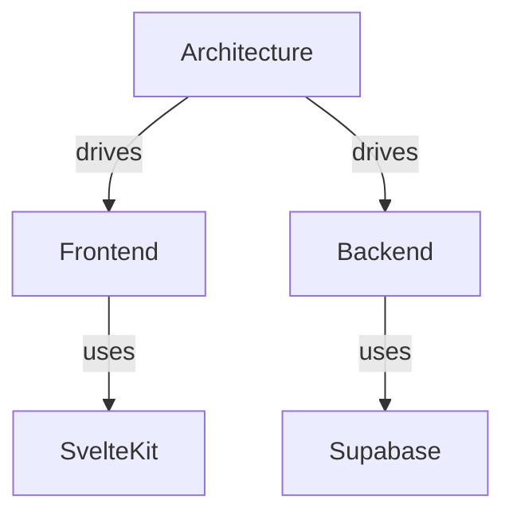

# Skill 06 — Export and Integration

> **What this teaches:** How to get data out of BendScript — export formats,
> import, MCP integration for agents, REST API access, and pricing tiers.

---

## Data Freedom Principle

> If you cannot export everything at any time, we have failed.

Graph portability is a hard requirement. BendScript never locks your knowledge
behind proprietary formats.

---

## Export Formats

### JSON Export

Full graph state as a single JSON file. This is the canonical export — it
preserves everything.

```json
{
  "workspace": { "name": "My Project", "slug": "my-project" },
  "planes": [
    {
      "id": "plane_1",
      "name": "Root",
      "is_root": true,
      "nodes": [
        { "id": "n1", "text": "Architecture", "type": "stargate", "x": 100, "y": 200 }
      ],
      "edges": [
        { "source": "n1", "target": "n2", "type": "causal", "label": "drives" }
      ]
    }
  ]
}
```

**Includes:** All planes, nodes (with positions, types, metadata), edges (with
types, labels, strength), and Stargate hierarchy.

**Use case:** Backup, restore, migration between workspaces, version control.

### Markdown Outline Export

Flattens a graph plane into a nested Markdown document. The hierarchy follows
edge relationships — parent nodes become headings, child nodes become nested
content.

```markdown
# Architecture
  ## Frontend
    - SvelteKit 2.x
    - HTML5 Canvas engine
  ## Backend
    - Supabase (Postgres)
    - pgvector for embeddings
```

**Use case:** Documentation generation, sharing with non-graph tools, reading
in any Markdown viewer.

### Mermaid Diagram Export

Generates Mermaid diagram syntax from the graph structure. Renders in GitHub,
Notion, Obsidian, and most Markdown tools.



**Use case:** Embedding in documentation, sharing in GitHub issues/PRs,
visual overviews.

---

## JSON Import

Reload a previously exported JSON file to restore a graph.

- Creates a new graph in the target workspace.
- Preserves all planes, nodes, edges, and Stargate hierarchy.
- Positions are restored — the layout matches the export.

---

## MCP Integration

Agents connect to BendScript via MCP (Model Context Protocol) using Streamable
HTTP/SSE transport.

### Connection

Add BendScript to your MCP client configuration:

```json
{
  "mcpServers": {
    "bendscript": {
      "url": "https://your-instance.bendscript.com/mcp",
      "transport": "streamable-http"
    }
  }
}
```

### Available Tools

| Tool | Category | Purpose |
|------|----------|---------|
| `search_nodes` | Query | Find nodes by text similarity |
| `get_subgraph` | Query | Retrieve node neighborhood |
| `traverse_path` | Query | Follow typed edges |
| `query_graph` | Query | Natural language KAG query |
| `list_planes` | Query | Enumerate workspace planes |
| `build_from_text` | Write | Ingest text into graph structure |

See [04_KAG_SERVER.md](04_KAG_SERVER.md) for detailed tool documentation.

### AGENTS.md Discovery

BendScript publishes an `AGENTS.md` file at the workspace root that describes
the available agent interface — tools, capabilities, and usage guidelines.
MCP-compatible agents can discover BendScript's capabilities by reading this
file.

---

## REST API Access

In addition to MCP, BendScript exposes a REST API for KAG queries.

### Authentication

REST API requests require an API key in the `Authorization` header:

```
Authorization: Bearer bsk_live_...
```

API keys are scoped to a workspace and respect the same RLS policies as
direct database access.

### Endpoints

| Method | Path | Purpose |
|--------|------|---------|
| POST | `/api/kag/query` | Natural language KAG query |
| POST | `/api/kag/search` | Node search by text |
| GET | `/api/kag/planes` | List planes |
| GET | `/api/kag/subgraph/:node_id` | Get node neighborhood |

---

## Pricing Tiers and API Limits

| Feature | Free | Pro | Team |
|---------|------|-----|------|
| Manual graph editing | unlimited | unlimited | unlimited |
| AI Tiers 1-3 | Haiku 4.5 | Sonnet 4.6 | Sonnet 4.6 |
| AI Tier 4 (edge inference) | no | yes | yes |
| MCP tools | 100 calls/day | 5,000 calls/day | 25,000 calls/day |
| REST API | no | yes | yes |
| Team workspaces | no | no | yes |
| Export (JSON/MD/Mermaid) | yes | yes | yes |

---

## Integration Patterns

### BendScript + Graphonomous

BendScript provides human-built knowledge (`&memory.graph` as KAG).
Graphonomous provides agent-built knowledge (continual learning). Together:

1. Human builds knowledge graph in BendScript.
2. Agent queries BendScript via MCP for domain knowledge.
3. Agent stores learnings in Graphonomous.
4. Agent can use `build_from_text` to feed discoveries back into BendScript.

### BendScript + External Agents

Any MCP-compatible agent can connect to BendScript. Common patterns:

- **Research agent** — queries BendScript for prior knowledge before answering.
- **Documentation agent** — ingests docs via `build_from_text`, then answers
  questions via `query_graph`.
- **Planning agent** — builds a project graph, then traverses it to generate
  task lists.
